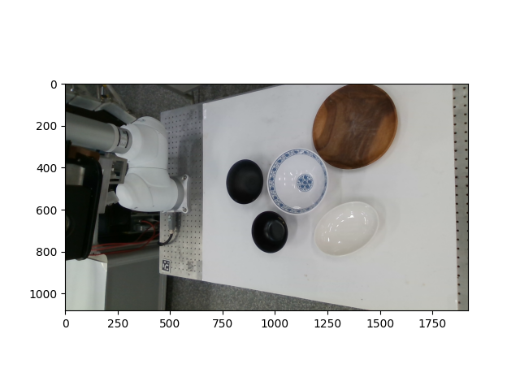
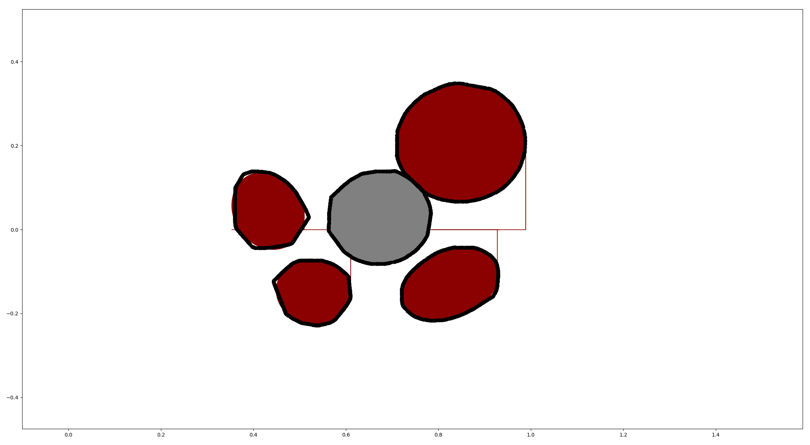
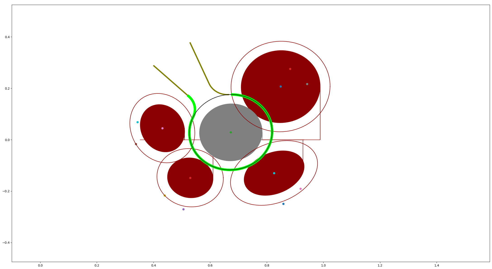
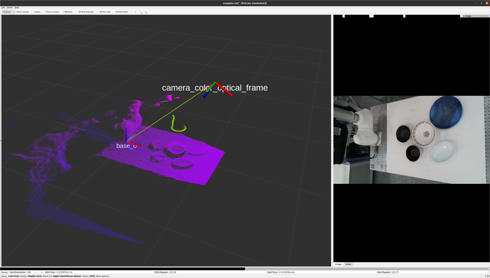

# swipe_across_the_dishes
A module that creates a path to make space for the gripping dishes.

## Setup
### 1. build package
```sh
cd ~/catkin_ws/src
git clone https://github.com/HJS-HJS/swipe_across_the_dishes.git
cd ..
catkin_make
```

### 2. Dependencies
```sh
cd ~/catkin_ws/src/swipe_across_the_dishes
pip install -r requirements.txt    
```

### 3. Install ROS requirement msg 

```sh
sudo apt-get install ros-noetic-vision-msgs ros-noetic-sensor-msgs ros-noetic-geometry-msgs ros-noetic-std-msgs ros-noetic-moveit-msgs ros-noetic-nav-msgs ros-noetic-tf
```

## Swipe Across the Dishes
#### 1. set configuration
in [config.yaml](./config/config.yaml),

- planner
    - gripper (str, dafault"hanyang"): 
        - Gripper type
    - visualize (bool, default False): 
        - Visualize tableware edge sampling and path creation results with matplotlib
    - show_finger_path (bool, default False): 
        - Publish the gripper finger path and end effector to nav_msgs/path in rostopic so that they can be checked in rviz.
    - dish_r_margin (float, default 0.035 m): 
        - The value of how far away from the dish to draw the path.
    - swipe_a_margin (float, default 5.0 deg): 
        - The angle at which to add more sweeping paths from the target dish center.
    - swipe_speed (float, default 0.07 m/s): 
        - Speed ​​of gripper finger to swipe the tableware
    - height (float default 0.015 m): 
        - Height between gripper end effector and table floor
- gripper:
    - hanyang:
        - width (float, default 0.10 m): 
            - Gripper finger-to-finger width
        - height (float, default 0.343421 m):
            - Gripper's z-axis height. 
            - Height difference between the end effector of the robot arm and the end effector of the gripper.
        - z_angle (float, default +13.1825deg): 
            - Z-axis rotation direction of the robot's end effector coordinate system and the gripper's coordinate system

#### 2. Services
- /swipe_across_ths_dishes/get_swipe_dish_path ([swipe_across_ths_dishes/GetSwipeDishesPath](./srv/GetSwipeDishesPath.srv))

    #### 1. request
    - dish_segmentation ([vision_msgs/Detection2DArray](https://docs.ros.org/en/noetic/api/vision_msgs/html/msg/Detection2DArray.html)): 
        - Dish segmentation result (KIST vision module output)
    - table_detection ([vision_msgs/BoundingBox3D](https://docs.ros.org/en/lunar/api/vision_msgs/html/msg/BoundingBox3D.html)): 
        - Table detection result (KIST vision module output)
    - depth_image ([sensor_msgs/Image](https://docs.ros.org/en/noetic/api/sensor_msgs/html/msg/Image.html)): 
        - Depth image of the entire scene
    - camera_info ([sensor_msgs/CameraInfo](https://docs.ros.org/en/noetic/api/sensor_msgs/html/msg/CameraInfo.html)): 
        - Camera info of the depth camera
    - camera_pose ([geometry_msgs/PoseStamped](https://docs.ros.org/en/noetic/api/geometry_msgs/html/msg/PoseStamped.html)): 
        - Depth camera pose
    - target_id ([std_msgs/Int32](https://docs.ros.org/en/melodic/api/std_msgs/html/msg/Int32.html)): 
        - Order of tableware targeted by dish_segmentation
    #### 2. response
    - path ([moveit_msgs/CartesianTrajectory](https://docs.ros.org/en/noetic/api/moveit_msgs/html/msg/CartesianTrajectory.html)): 
        - Path of the robot end-effector to make space for the gripping task
    - plan_successful (bool): 
        - True if the plan was successful. False if the plan failed. In this case, the module reutrns a dummy path.
    - gripper_pose (float32): 
        - Gripper width to swipe


### 3. Launch swipe_across_the_dishes ros node
1. Launch the swipe_across_the_dishes planning server node

    ```sh
    roslaunch swipe_across_the_dishes server.launch
    ```

### 4. Example
1. Launch the example server while swipe_across_the_dishes node is running

    ```sh
    roslaunch swipe_across_the_dishes example.launch 
    ```
2. press enter to request the swipe-path

    The following image can be checked by setting visualize to True in condig.yaml.

    -  Example rbg image
    <div align="center">
    
    </div>

    -  Tableware after edge sampling
    <div align="center">
    
    </div>

    -  Generated swipe path
    <div align="center">
    
    </div>

    -  Depth image, swipe path visualized in rviz
    <div align="center">
    
    </div>
